# USER-GUIDE

# Guide Utilisateur — Plateforme de billetterie Paris 2024

> **Version** : 1.0 — Avril 2026
> 
> 
> **Public** : Administrateurs, Staff, Utilisateurs
> 

---

## Table des matières

1. [Présentation générale](about:blank#1-pr%C3%A9sentation-g%C3%A9n%C3%A9rale)
2. [Accès & Identifiants](about:blank#2-acc%C3%A8s--identifiants)
3. [Parcours Utilisateur](about:blank#3-parcours-utilisateur)
    - 3.1 Création de compte
    - 3.2 Connexion
    - 3.3 Explorer les événements
    - 3.4 Ajouter au panier
    - 3.5 Passer commande (checkout)
    - 3.6 Consulter ses billets
    - 3.7 Télécharger un billet PDF
    - 3.8 Réinitialiser son mot de passe
4. [Parcours Staff](about:blank#4-parcours-staff)
    - 4.1 Connexion staff
    - 4.2 Scanner un billet
    - 4.3 Interpréter les résultats de scan
5. [Parcours Administrateur](about:blank#5-parcours-administrateur)
    - 5.1 Connexion admin
    - 5.2 Tableau de bord
    - 5.3 Gérer les événements
    - 5.4 Gérer les offres
    - 5.5 Consulter les ventes
    - 5.6 Gérer les utilisateurs
    - 5.7 Paramètres de la plateforme

---

## 1. Présentation générale

La plateforme de billetterie Paris 2024 permet :

- aux **utilisateurs** d’acheter des billets pour les épreuves olympiques
- au **staff** de valider les billets à l’entrée des sites via QR code
- aux **administrateurs** de piloter la plateforme : événements, offres, ventes, utilisateurs

L’application est accessible depuis n’importe quel navigateur (Chrome, Firefox, Safari, Edge) sur ordinateur, tablette et mobile.

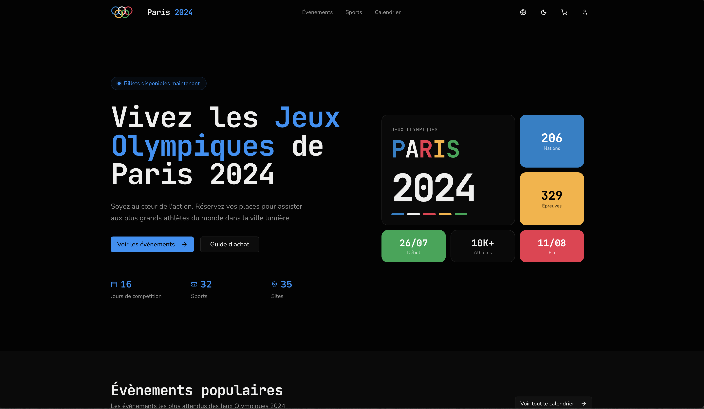

Capture : page d’accueil

---

## 2. Accès & Identifiants

| Rôle | Email | Mot de passe |
| --- | --- | --- |
| Utilisateur | `user@jo.com` | `UserJo2024!` |
| Staff | `staff@jo.com` | `StaffJo2024!` |
| Administrateur | `admin@jo.com` | `AdminJo2024!` |

> Les comptes de test sont préconfigurés.
> 

---

## 3. Parcours Utilisateur

### 3.1 Création de compte

1. Ouvrir la plateforme dans le navigateur.
2. Cliquer sur l’icône d’utilisateur dans la barre de navigation en haut à droite.

Capture : bouton connexion dans le header

1. Sur la page d’authentification, cliquer sur **“Créer un compte”** (ou le lien de bascule sous le formulaire).

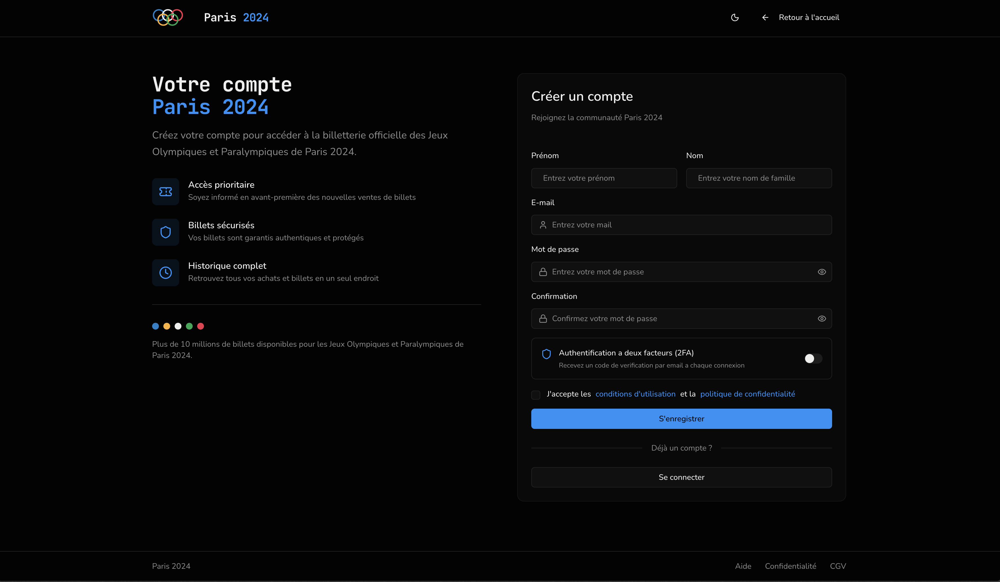

Capture : page d’authentification — onglet inscription

1. Remplir le formulaire :
    - **Prénom** et **Nom**
    - **Email (accessible pour le réception des billets / codes 2FA)**
    - **Mot de passe** (minimum 8 caractères dont 1 majuscule / 1 minuscule / 1 caractère spécial / 1 chiffre)
    - **Confirmer le mot de passe**
2. Cliquer sur **“Créer mon compte”**.
3. En cas de succès, la session s’ouvre automatiquement et vous êtes redirigé vers la page d’accueil.

> **Si un message d’erreur apparaît** : vérifier que les mots de passe correspondent et que l’email n’est pas déjà utilisé.
> 

---

### 3.2 Connexion

1. Cliquer sur l’icône d’utilisateur dans le header.
2. Saisir votre **email** et votre **mot de passe**.
3. Cliquer sur **“Se connecter”**.

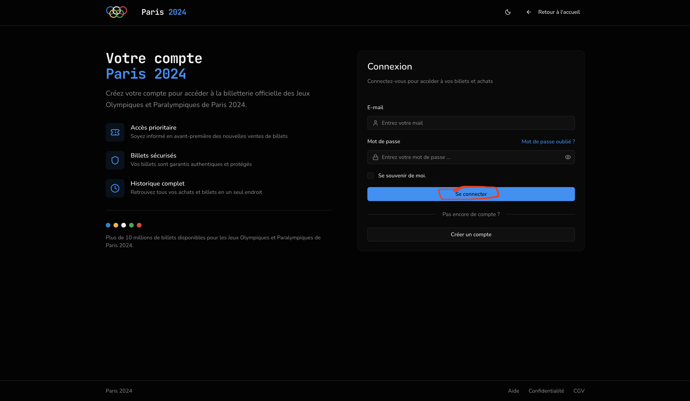

Capture : formulaire de connexion rempli

1. Si la connexion réussit, vous êtes redirigé vers la page d’accueil avec votre prénom affiché dans le header.

> **Mot de passe oublié ?** Voir la section [3.8 Réinitialiser son mot de passe](about:blank#38-r%C3%A9initialiser-son-mot-de-passe).
> 

---

### 3.3 Explorer les événements

### Via la page d’accueil

La page d’accueil affiche :
- une **bannière hero** avec les dates des Jeux
- **6 événements mis en avant** dans une section dédiée
- les **catégories sportives** pour filtrer par sport
- les **offres en cours** (solo, duo, famille, etc.)

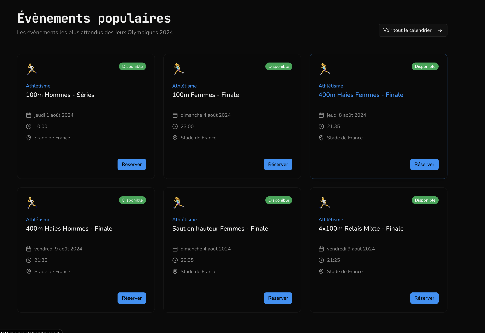

Capture : section événements mis en avant

Cliquer sur un événement pour accéder à sa page détail.

### Via le calendrier

1. Cliquer sur **“Calendrier”** dans la navigation.
2. Naviguer entre les jours en utilisant les flèches gauche/droite.
3. Chaque journée liste les épreuves programmées avec leurs horaires.
4. Cliquer sur une épreuve pour accéder à sa page détail.

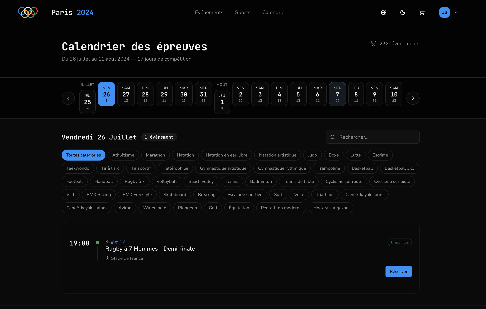

Capture : vue calendrier avec liste d’événements

### Via la page d’un sport

1. Cliquer sur un sport dans la section “Catégories” de l’accueil.
2. La page sport affiche : description, nombre d’épreuves, sites concernés, phases de compétition.
3. Cliquer sur **“Voir le calendrier”** pour filtrer les événements par ce sport.

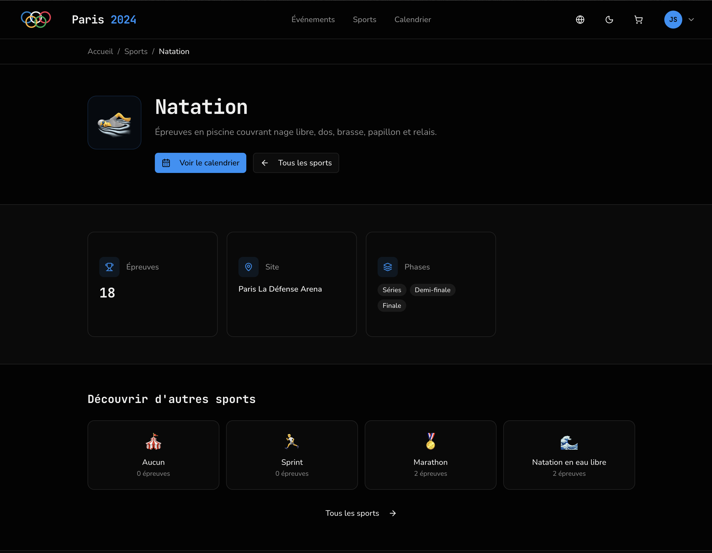

Capture : page détail d’un sport

### Page détail d’un événement

La page événement affiche :
- le nom de l’épreuve, le sport, la phase (qualifications, demi-finale, finale…)
- la date, l’heure et le lieu
- la **jauge de disponibilité** (Disponible / Limité / Complet)
- le descriptif de l’épreuve

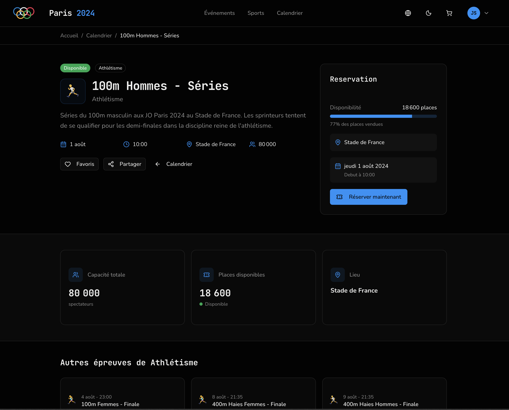

Capture : page détail événement avec jauge de disponibilité

---

### 3.4 Ajouter au panier

Depuis la page détail d’un événement :

1. Cliquer sur **“Réserver”**.
2. Une fenêtre modale s’ouvre.

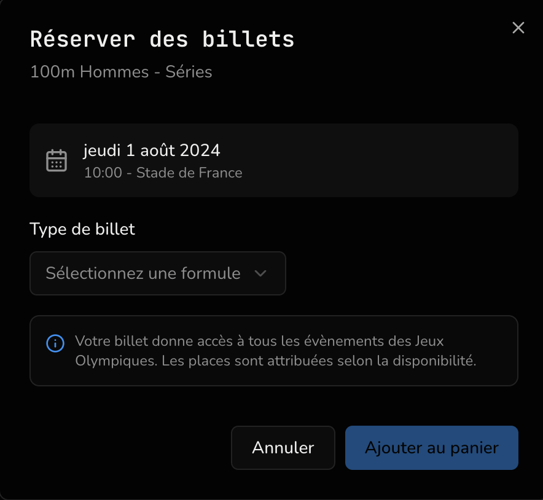

Capture : dialog de réservation

1. Choisir l’**offre** souhaitée (Solo, Duo, Famille, etc.) — chaque offre indique le nombre de places incluses et le tarif.
2. Cliquer sur **“Ajouter au panier”**.
3. Une notification de confirmation apparaît. L’icône panier dans le header se met à jour.

> Si vous n’êtes pas connecté, vous serez redirigé vers la page de connexion avant de pouvoir ajouter au panier.
> 

### Consulter et modifier le panier

1. Cliquer sur l’**icône panier** (🛒) dans le header.
2. Un panneau latéral s’ouvre avec le récapitulatif des articles.

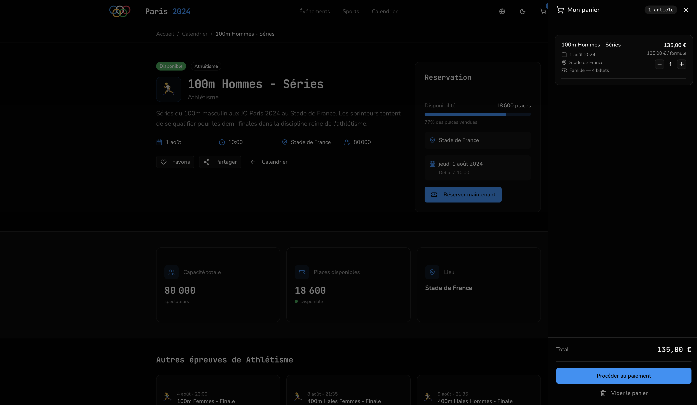

Capture : sidebar panier ouverte

1. Pour modifier la quantité : utiliser les boutons `−` et `+` sur chaque ligne.
2. Pour supprimer un article : cliquer sur l’icône de suppression (corbeille).
3. Le total se recalcule automatiquement.
4. Cliquer sur **“Passer commande”** pour accéder au checkout.

---

### 3.5 Passer commande (checkout)

> Le panier doit contenir au moins un article.
> 
1. Depuis le panier, cliquer sur **“Passer commande”**.
2. La page de checkout affiche le récapitulatif complet :
    - Nom de l’événement, offre, quantité, prix unitaire
    - Date, heure, lieu
    - Total général

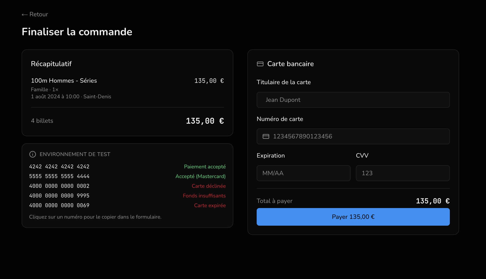

Capture : page checkout — récapitulatif commande

1. Remplir le formulaire de paiement par carte :

| Champ | Valeur à saisir |
| --- | --- |
| Titulaire de la carte | Votre nom complet |
| Numéro de carte | `4242 4242 4242 4242` (test) |
| Date d’expiration | `12/26` (toute date future) |
| CVV | `123` |
1. Cliquer sur **“Confirmer et payer”**.
2. Un indicateur de chargement s’affiche pendant le traitement.
3. En cas de succès, vous êtes automatiquement redirigé vers la page de confirmation.

> **Numéros de carte de test disponibles :**
- `4242 4242 4242 4242` — Visa (succès)
- `5555 5555 5555 4444` — Mastercard (succès)
> 

---

### 3.6 Consulter ses billets

### Page de confirmation (juste après l’achat)

La page de confirmation affiche :
- une icône de validation verte
- la **référence de paiement**
- le montant et la date de transaction
- les **billets individuels** avec : nom du titulaire, email, événement, offre, date, code-barre, prix

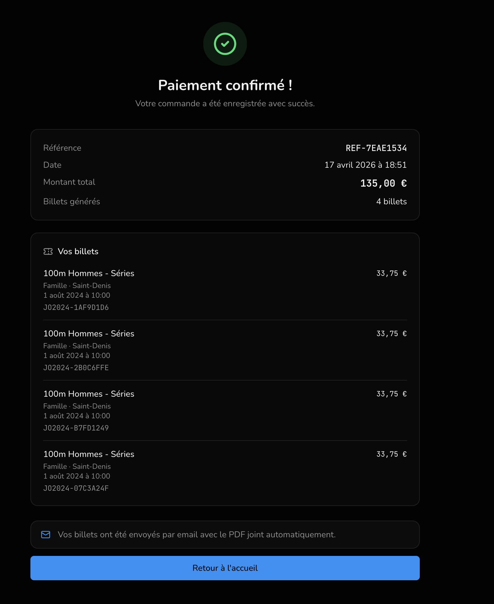

Capture : page confirmation achat

Un email de confirmation est envoyé automatiquement à l’adresse utilisée lors de l’achat.

### Page “Mes billets”

Pour retrouver vos billets à tout moment :

1. Être connecté.
2. Cliquer sur **“Mes billets”** dans le menu utilisateur (ou naviguer vers `/billets`).
3. La page affiche un résumé statistique : nombre de commandes, total de places, billets actifs, billets utilisés.
4. Les billets sont regroupés par transaction et par événement.

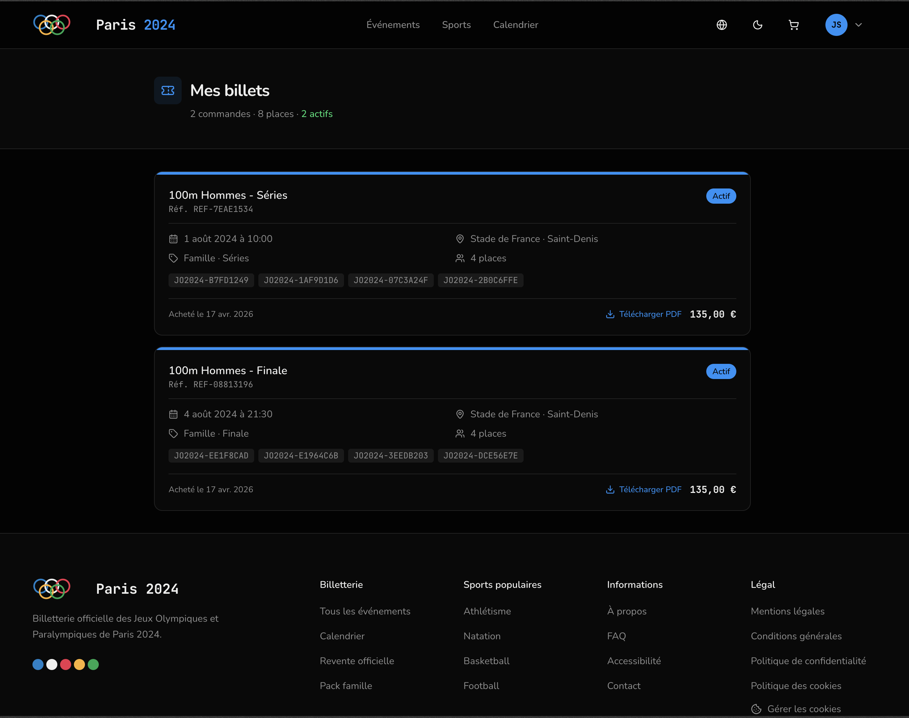

Capture : page mes billets — liste des groupes

---

### 3.7 Télécharger un billet PDF

Depuis la page **“Mes billets”** :

1. Repérer le groupe de billets souhaité.
2. Cliquer sur le bouton **“Télécharger PDF”** (icône téléchargement).

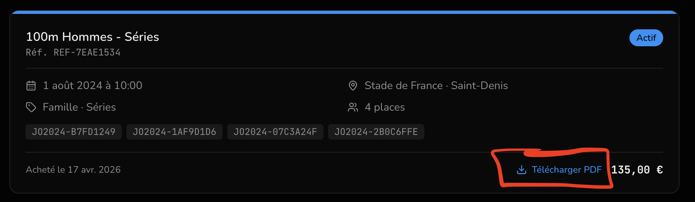

Capture : bouton télécharger PDF sur un groupe de billets

1. Le PDF s’ouvre dans un nouvel onglet ou se télécharge selon les paramètres du navigateur.
2. Le PDF contient le QR code à présenter à l’entrée du site olympique.

> Imprimer le billet ou le garder sur smartphone — les deux formats sont acceptés.
> 

---

### 3.8 Réinitialiser son mot de passe

1. Sur la page de votre compte, cliquer sur **“Changer le mot de passe”**.
2. Saisir votre ancien et votre nouveau mot de passe (avec confirmation).

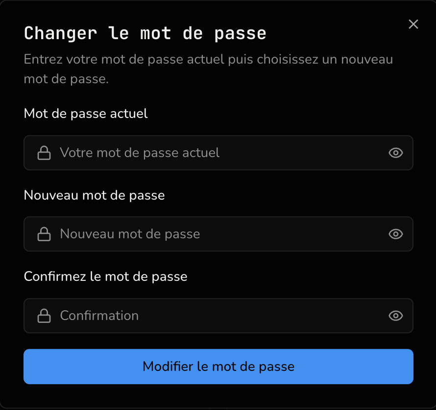

---

## 4. Parcours Staff

Le staff est chargé de valider les billets à l’entrée des sites olympiques en scannant les QR codes.

### 4.1 Connexion staff

1. Ouvrir la plateforme dans le navigateur.
2. Cliquer sur l’icône de connexion.
3. Saisir les identifiants staff : `staff@jo.com` / `StaffJo2024!`
4. Après connexion, vous êtes automatiquement redirigé vers l’interface de scan `/staff`.

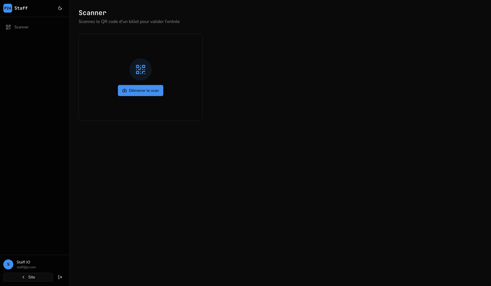

---

### 4.2 Scanner un billet

### Prérequis

- Autoriser l’accès à la **caméra** du téléphone ou de la tablette lorsque le navigateur le demande.
- S’assurer d’être dans une zone avec une connexion réseau stable.

### Procédure de scan

1. Sur l’interface staff, cliquer sur **“Démarrer le scan”**.

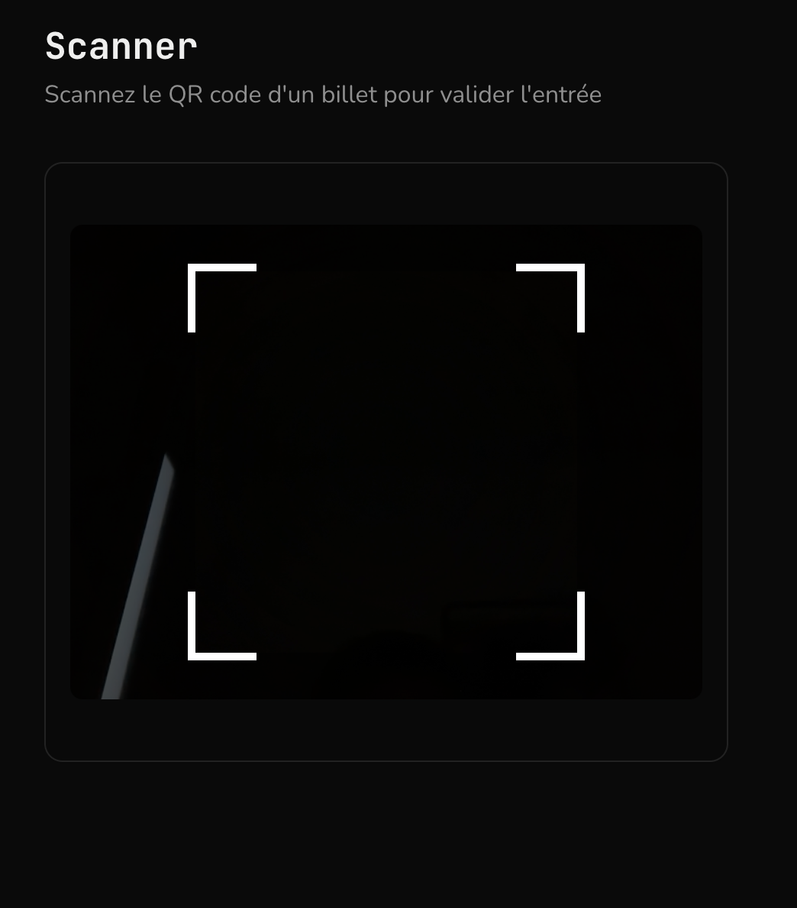

1. La caméra s’active. Pointer l’appareil vers le **QR code du billet** (imprimé ou affiché sur l’écran du visiteur).

1. L’application détecte automatiquement le QR code — pas besoin d’appuyer sur un bouton.
2. Un indicateur de chargement s’affiche brièvement pendant la vérification du billet auprès du serveur.

---

### 4.3 Interpréter les résultats de scan

Le résultat s’affiche immédiatement après la vérification. Quatre états possibles :

### ✅ SUCCÈS — Billet valide

Le billet est authentique et n’a jamais été utilisé.

- Fond **vert**
- Badge **“VALIDE”**
- Affichage : nom du titulaire, email, événement, date, lieu, phase, offre

**Action à effectuer :** Laisser passer le visiteur.

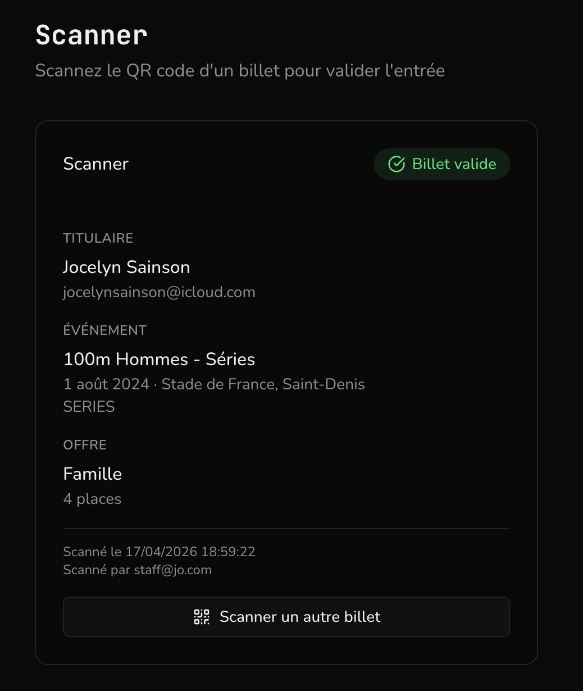

### 🟠 DÉJÀ UTILISÉ — Billet déjà scanné

Ce billet a déjà été présenté à l’entrée.

- Fond **orange**
- Badge **“DÉJÀ UTILISÉ”**
- Affichage : mêmes informations que ci-dessus

**Action à effectuer :** Refuser l’entrée. Demander au visiteur de se rapprocher de l’accueil pour vérification.

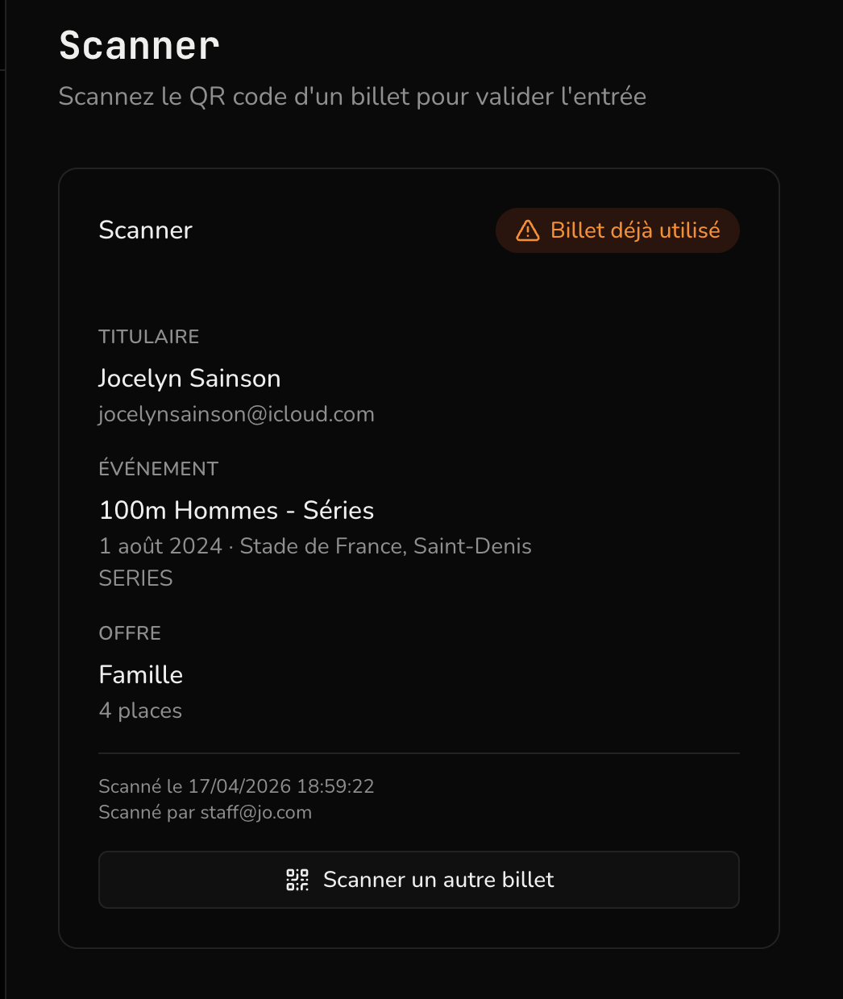

### 🔴 INVALIDE — Billet non reconnu

Le QR code n’est pas reconnu dans le système.

- Fond **rouge**
- Badge **“INVALIDE”**

**Action à effectuer :** Refuser l’entrée. Diriger le visiteur vers le service billetterie.

### ⚫ ANNULÉ — Billet annulé

Le billet a été annulé par le système.

- Fond **gris**
- Badge **“ANNULÉ”**

**Action à effectuer :** Refuser l’entrée. Diriger le visiteur vers le service billetterie.

### Scanner un nouveau billet

Après chaque scan, cliquer sur **“Scanner un nouveau billet”** pour réinitialiser l’interface et traiter le visiteur suivant.

---

## 5. Parcours Administrateur

L’administrateur gère l’intégralité de la plateforme : événements, offres, ventes, utilisateurs et configuration.

### 5.1 Connexion admin

1. Ouvrir la plateforme dans le navigateur.
2. Cliquer sur l’icone de connexion.
3. Saisir les identifiants admin : `admin@jo.com` / `AdminJo2024!`
4. Après connexion, vous êtes redirigé vers le tableau de bord admin `/admin`.

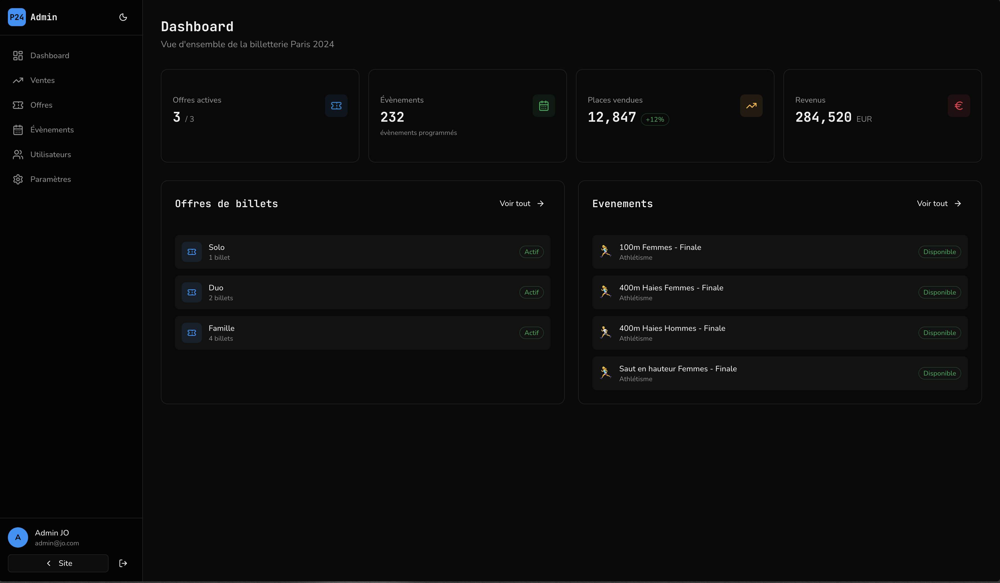

La navigation admin se compose :
- Sur **ordinateur** : d’une barre latérale gauche fixe
- Sur **mobile/tablette** : d’un menu hamburger en haut de page

---

### 5.2 Tableau de bord

Le tableau de bord donne une vue instantanée des indicateurs clés.

**Métriques affichées :**

| Indicateur | Description |
| --- | --- |
| Offres actives | Nombre d’offres actuellement disponibles à la vente |
| Événements | Nombre d’événements planifiés |
| Billets vendus | Total cumulé avec tendance (+12%) |
| Revenus | Chiffre d’affaires total en euros |

**Sections :**
- **Offres récentes** : les 4 dernières offres créées
- **Événements récents** : les 4 derniers événements ajoutés

Cliquer sur n’importe quel élément pour accéder à la page de gestion correspondante.

---

### 5.3 Gérer les événements

**Accès :** Menu latéral → **Évènements** (ou `/admin/evenements`)

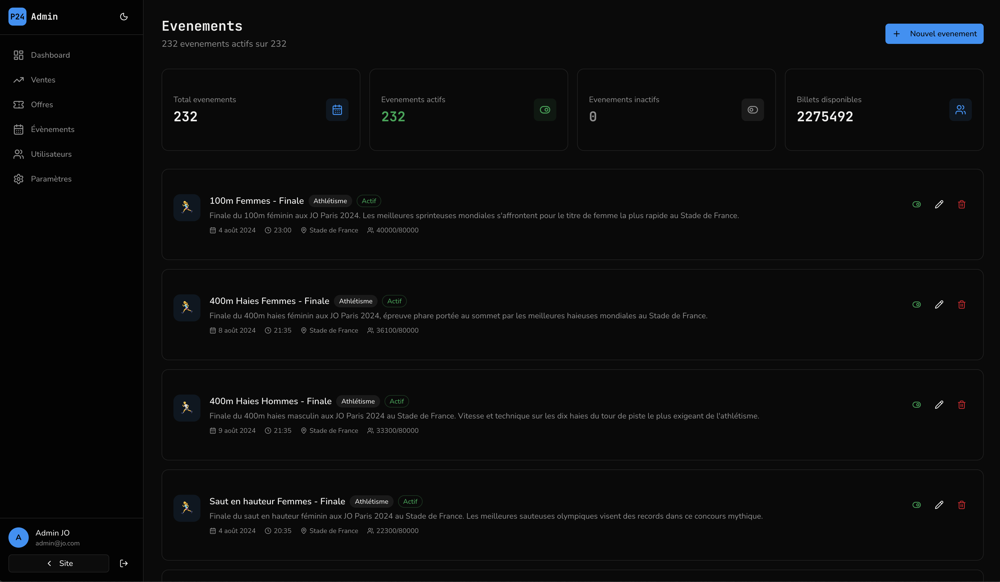

La page affiche en haut un résumé statistique (total, actifs, inactifs, places disponibles), puis toutes les cartes événement.

### Créer un événement

1. Cliquer sur le bouton **“Créer un événement”** (haut de page, bouton bleu).
2. Une fenêtre modale s’ouvre avec le formulaire de création.

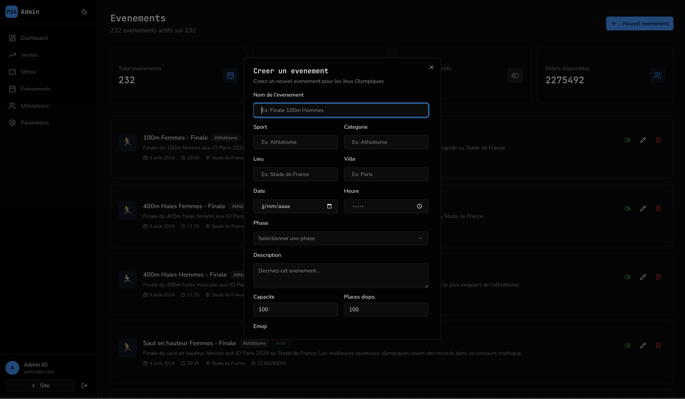

1. Remplir les champs :
    - **Nom** de l’épreuve
    - **Sport** associé
    - **Date et heure** de début
    - **Lieu / Site olympique**
    - **Capacité** (nombre de places maximum)
    - **Phase** (qualifications, demi-finale, finale…)
    - **Description**
2. Cliquer sur **“Créer”** pour valider.
3. L’événement apparaît immédiatement dans la liste.

### Modifier un événement

1. Sur la carte de l’événement à modifier, cliquer sur l’icône **crayon** (édition).
2. La modale s’ouvre pré-remplie avec les données actuelles.
3. Modifier les champs souhaités.
4. Cliquer sur **“Enregistrer”**.

### Désactiver / Réactiver un événement

Sur la carte événement, cliquer sur le **toggle** (interrupteur) pour basculer entre actif et inactif.

- **Actif** : l’événement est visible sur la plateforme publique et peut être acheté
- **Inactif** : l’événement est masqué pour les utilisateurs

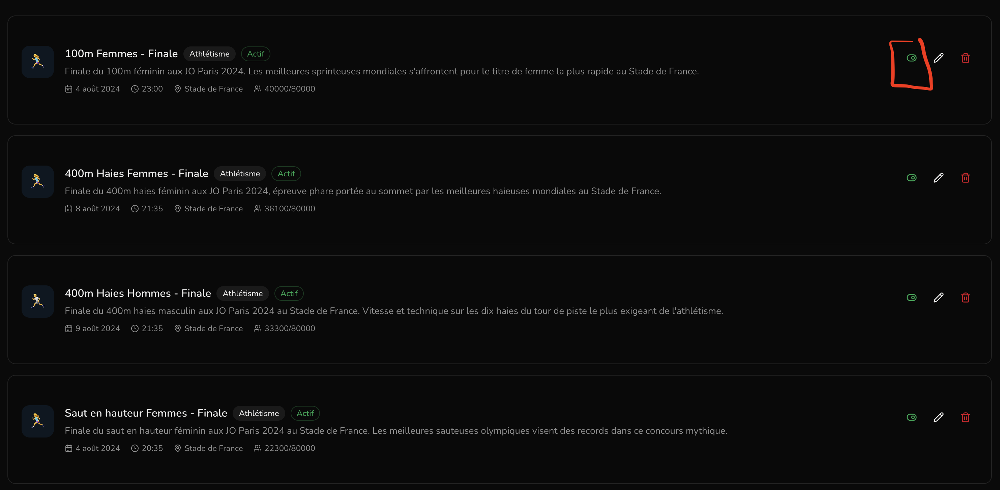

Capture : toggle actif/inactif sur une carte événement

### Supprimer un événement

1. Sur la carte événement, cliquer sur l’icône **corbeille**.
2. Une confirmation vous est demandée.
3. Confirmer la suppression — cette action est **irréversible**.

> Avant de supprimer un événement, s’assurer qu’aucune commande active ne lui est associée.
> 

---

### 5.4 Gérer les offres

**Accès :** Menu latéral → **Offres** (ou `/admin/offres`)

Les offres définissent les types de billets disponibles (Solo 1 place, Duo 2 places, Famille 4 places, etc.).

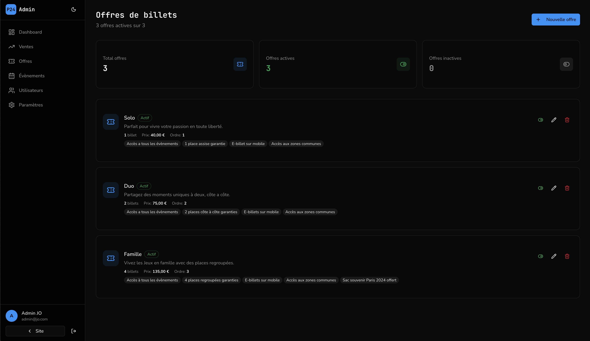

### Créer une offre

1. Cliquer sur **“Créer une offre”**.
2. Remplir le formulaire :
    - **Nom de l’offre** (ex. : “Offre Famille”)
    - **Nombre de billets** inclus (ex. : 4)
    - **Ordre d’affichage** (détermine l’ordre dans la liste publique)
3. Cliquer sur **“Créer”**.

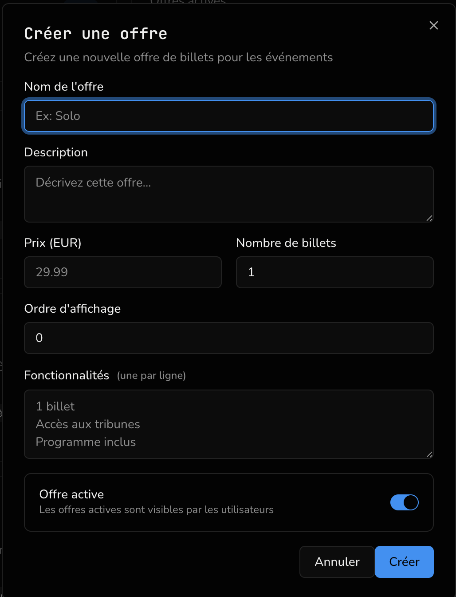

### Modifier une offre

1. Cliquer sur l’icône crayon sur la carte de l’offre.
2. Mettre à jour les champs.
3. Cliquer sur **“Enregistrer”**.

### Désactiver / Supprimer une offre

- **Toggle** : désactive l’offre (plus proposée lors de l’ajout au panier)
- **Corbeille** : supprime définitivement l’offre (confirmation requise)

---

### 5.5 Consulter les ventes

**Accès :** Menu latéral → **Ventes** (ou `/admin/ventes`)

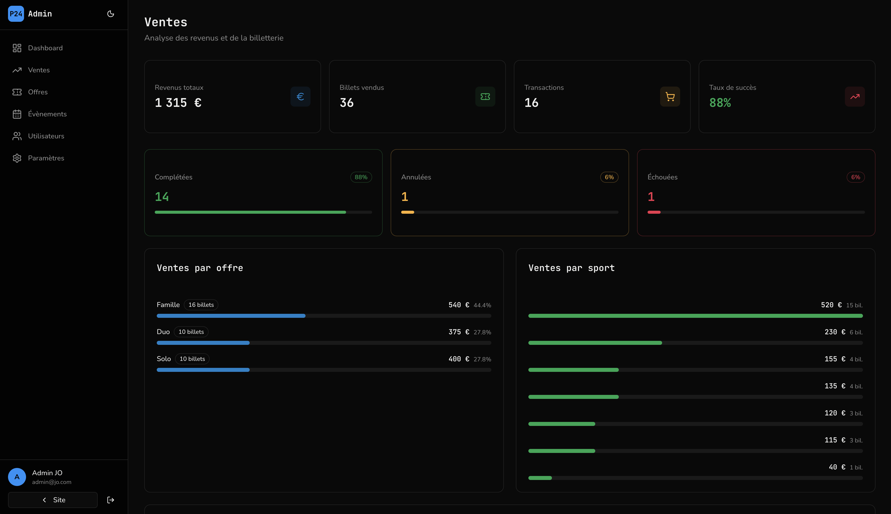

### Métriques principales

| Métrique | Description |
| --- | --- |
| Revenus totaux | Chiffre d’affaires cumulé en euros |
| Billets vendus | Nombre total de billets émis |
| Transactions | Nombre total de commandes |
| Taux de succès | Pourcentage de transactions abouties |

### Répartition par statut de transaction

Un bloc de synthèse présente la distribution des transactions :

- **Complétées** (vert) : transactions réussies avec paiement validé
- **Annulées** (jaune) : transactions abandonnées par l’utilisateur
- **Échouées** (rouge) : transactions refusées (paiement rejeté)

Chaque statut affiche le nombre absolu et le pourcentage, avec une barre de progression visuelle.

### Ventes par offre

Un graphique en barres montre les **revenus générés par chaque offre** (Solo, Duo, Famille…).

### Ventes par sport

Un graphique en barres montre le **nombre de billets vendus par discipline sportive**.

### Top événements

Un classement des 20 événements les plus vendeurs avec pour chacun :
- Nom de l’épreuve
- Nombre de billets vendus
- Revenus générés
- Barre de progression relative (pourcentage du maximum)

---

### 5.6 Gérer les utilisateurs

**Accès :** Menu latéral → **Utilisateurs** (ou `/admin/utilisateurs`)

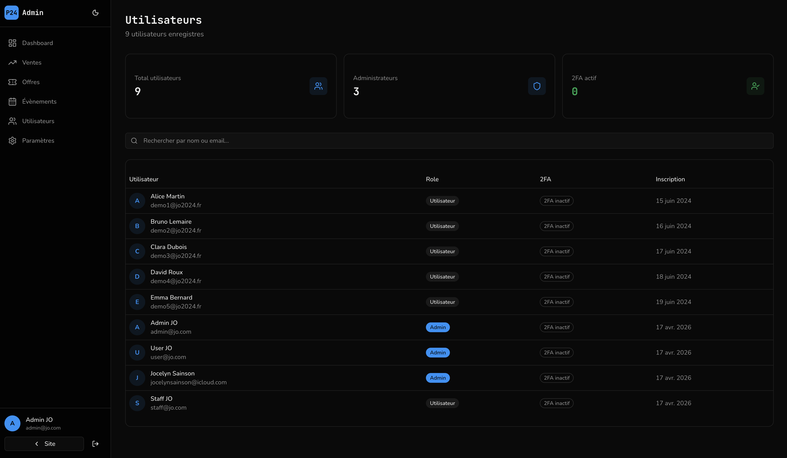

### Rechercher un utilisateur

Utiliser la **barre de recherche** en haut de page pour filtrer par nom ou email. La liste se met à jour en temps réel.

### Informations affichées par utilisateur

| Colonne | Description |
| --- | --- |
| Utilisateur | Avatar, prénom/nom, email |
| Rôle | ROLE_ADMIN ou ROLE_USER |
| 2FA | Authentification à deux facteurs activée ou non |
| Inscription | Date de création du compte |

### Statistiques

En haut de page : nombre total d’utilisateurs inscrits, nombre d’administrateurs, nombre de comptes avec 2FA activée.

---

## Annexe — Codes de test pour le paiement

| Numéro de carte | Réseau | Comportement |
| --- | --- | --- |
| `4242 4242 4242 4242` | Visa | Paiement accepté |
| `5555 5555 5555 4444` | Mastercard | Paiement accepté |
- Date d’expiration : toute date dans le futur (ex. : `12/26`)
- CVV : n’importe quel code à 3 chiffres (ex. : `123`)
- Nom du titulaire : n’importe quelle valeur

---

## Annexe — Messages d’erreur courants

| Message | Cause probable | Solution |
| --- | --- | --- |
| “Email déjà utilisé” | Un compte existe avec cet email | Utiliser un autre email ou se connecter |
| “Identifiants incorrects” | Email ou mot de passe erroné | Vérifier la saisie ou réinitialiser le mot de passe |
| “Accès refusé (403)” | Page réservée à un autre rôle | Se connecter avec le bon compte |
| “Panier vide” | Tentative de checkout sans article | Ajouter au moins un événement au panier |
| “Lien de réinitialisation expiré” | Lien utilisé après 24h | Faire une nouvelle demande de réinitialisation |
| “Erreur caméra” (staff) | Permissions caméra non accordées | Autoriser l’accès caméra dans les paramètres du navigateur |

---